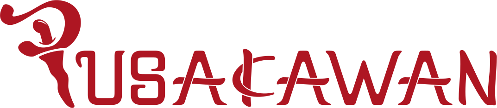

[Pusakawan Website](https://pusakawan.id/en)

# Introduction
Hi! I'm Sarah. The sole developer for this project. I will be documentating Pusakawan Web with these outlines:

* General good-to-knows
* Frameworks
* Project structure
* Philosophy during writing code
* Notes
* End-words

Hope this documentation will help you get the general idea of the project.

## General good-to-knows

We are using Next 13.4 with `src` directory. We don't have local API. Development API url is: `https://dev-api.pusakaapp.id/` using Django Rest API that is hosted on AWS EB.

This project uses `Typescript`, `pnpm`, and `node v18.17.1`.
This project is deployed on `Vercel` using Beni's Vercel account.

Our database uses PostgreSQL (also hosted in AWS) with Firebase for Google Authentication and realtime database (only for chatting, game answers and group states)

## Frameworks

#### UI-related
* MUI Material
* MUI Icons
* MUI Base (for Autocomplete and Select)
* MUI Lab (for LoadingButton only)
* React-Spring (for Modal animation)

#### Not UI-related
* axios: API related
* next-auth: client auth-related
* next-intl: client internationalization
* react-hook-form: form related with types
* pdf-lib: for auto-generate certification
* vercel analytics and vercel speed-insight

#### Utils-related
* dayjs: for Datepicker-calendar in MUI
* mui-tel-input, flag-icons: phone number input
* nextjs-progressbar: loading progressbar when directing to another route on top of website
* sharp: image-sharpening related

## Project structure
* ./public  
  Logos are here
  * assets  
  Images, SVG, third party logos, certificate, and Terms and condition page is here.

* ./src  
  middleware is here
  * components  
  styled components are here. I 99% of the time uses styled components.
  * lib  
  api call functions, constants, hooks, utils and firebase init
  * locales  
  a long page of ID/EN localization (i am not modularing any of it)
  * styles  
  one component had to use CSS
  * theme  
  MUI theming
  * types  
  my type is smart nerdy guys who share hobbies with me :heart_eyes:

## Philosophy
1. Don't modularize if it's only gonna be used one time. Instead, put it on a different function on the same page.
2. Space and categorize the logic-part of your code. 
3. Type your shit. Properly.

## Notes
Most of your UI-related designing will use MUI Material. If UI design doesn't match the already-existing resources in MUI Material, just use MUI Base.  
DO NOT use other UI framework.

We use `Poppins` from Next Font.

`<Link />` is MUI Link component integrated with Next.js Link. Read `theme.ts` for more overrides.

Some pictures' source is from unsplash.

Our courses is hosted from a public bucket in AWS. So you can actually see other courses because there's no account-payment check yet.

Also, the only **hook** you have is ratio-related because headers and certain design change.

## End words
I'm a straight-forward person. So I expect my codes to also be straighforward.  
Hope this helps.   
If you need any questions, Telegram me at @sarahT04.